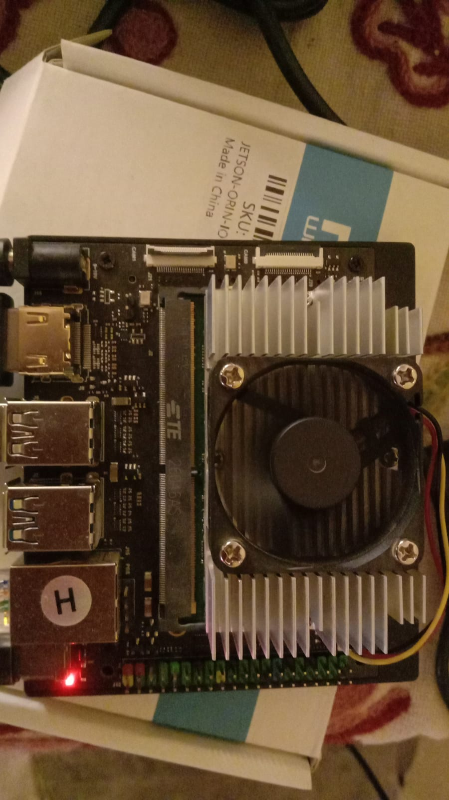
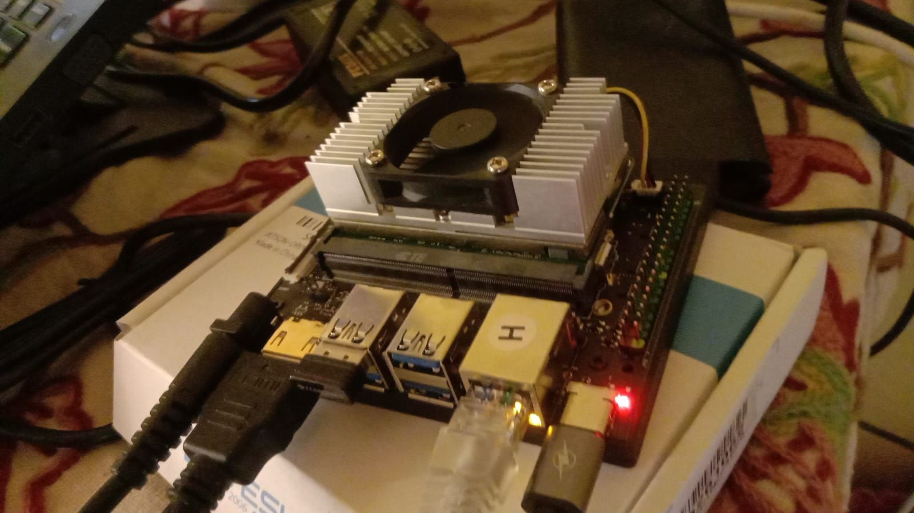

# SIMA Modalix YOLOv8 Drone Detection & Tracking



A real-time, industry-grade YOLOv8 object detection and tracking pipeline optimized for the **SiMa.ai Modalix DevKit**. This project runs a custom 5-class model (Drone, Person, Bird, Car, Airplane) with a P2-head architecture to detect small objects efficiently. It integrates the **BoT-SORT** algorithm for robust, motion-based object tracking over RTSP video streams.

---

## 🌟 Key Features

- **Custom 5-Class Detection:** Fine-tuned YOLOv8 model capable of detecting Drone, Person, Bird, Car, and Airplane.
- **Small Object Detection:** Employs a P2-head architecture specifically optimized for small and distant drone detection.
- **Robust Tracking:** Integrates the BoT-SORT tracker (Kalman filter + 2-stage IoU association) for smooth and persistent tracking.
- **Real-Time Inference:** Processes live RTSP streams using SiMa.ai’s Machine Learning Accelerator (MLA).
- **Visualization:** Integrates seamlessly with Neat Insight for real-time dashboard visualization.

---

## 📸 Media Overview

### Modalix DevKit Setup


### Tracking Demonstration
Check out the real-time tracking performance in the following video:

<video src="Images/tracking_calib_0.mp4" controls width="100%">
  Your browser does not support the video tag.
</video>
*(Note: Video playback might require cloning the repository and playing locally if GitHub preview does not support it.)*

---

## 🗂 Project Structure

```text
.
├── Images/                                # Images and videos used in documentation
├── models/
│   ├── yolov8_drone_p2_mpk.tar.gz         # Compiled model (MLA elf + manifest + box decoder config)
│   └── yolov8_drone_p2_labels.txt         # Class labels
└── yolov8_drone_detection_tracking/
    ├── src/common/
    │   └── config.yaml                    # RTSP source, model paths, decode/tracker thresholds
    └── src/python/
        ├── main.py                        # RTSP -> MLA inference -> decode -> BoT-SORT -> Insight
        ├── yolo_decode.py                 # DFL decode, P2/4-scale-aware
        ├── bot_sort.py                    # BoT-SORT tracker implementation
        └── requirements.txt               # Python dependencies
```

---

## 🛠 Prerequisites

Before deploying the application, ensure you have the following setup:

### Hardware
- **SiMa.ai Modalix DevKit** connected to your local network.
- A **Host PC/Laptop** running Linux or Windows with WSL2 to host the RTSP stream and HTTP server.

### Software Environment
1. **On the Board:** 
   - `sima-cli` installed and configured.
   - A valid Python virtual environment (e.g., `~/pyneat`) installed.
2. **On the Host PC:**
   - Docker installed.
   - Neat Insight / mediamtx running in the `ghcr.io/sima-neat/sdk:latest` container.

Check the Docker container status on your Host PC:
```bash
docker exec ghcr.io-sima-neat-sdk-latest supervisorctl status neat-insight
```

---

## 🚀 Installation & Deployment

This project prefers deploying via a local HTTP server instead of SSH for efficiency and isolation. Follow these steps:

### 1. Host the Files locally (Host PC)
Navigate to the root of this cloned repository and start an HTTP server:

```bash
cd SIMA-Modalix-YOLOV8-drone-detection-tracking
python3 -m http.server 8090 --bind 0.0.0.0
```
*Note your Host PC's IP address (e.g., `192.168.50.1`).*

### 2. Transfer to the Modalix DevKit
Open a console to your Modalix DevKit and fetch the necessary files:

```bash
cd /root/prebuilt-apps
mkdir -p models examples/tracking

# Fetch Models
curl -o models/yolov8_drone_p2_mpk.tar.gz http://<YOUR_HOST_IP>:8090/models/yolov8_drone_p2_mpk.tar.gz
curl -o models/yolov8_drone_p2_labels.txt http://<YOUR_HOST_IP>:8090/models/yolov8_drone_p2_labels.txt

# Create Source Directories
mkdir -p examples/tracking/yolov8_drone_detection_tracking/src/python
mkdir -p examples/tracking/yolov8_drone_detection_tracking/src/common

# Fetch Source Code
for f in main.py yolo_decode.py bot_sort.py requirements.txt; do
  curl -o examples/tracking/yolov8_drone_detection_tracking/src/python/$f \
    http://<YOUR_HOST_IP>:8090/yolov8_drone_detection_tracking/src/python/$f
done

# Fetch Config
curl -o examples/tracking/yolov8_drone_detection_tracking/src/common/config.yaml \
  http://<YOUR_HOST_IP>:8090/yolov8_drone_detection_tracking/src/common/config.yaml
```

---

## 💻 Usage

Once the files are correctly placed on the Modalix board, activate your environment and execute the pipeline.

```bash
# Activate virtual environment
source ~/pyneat/bin/activate

# Navigate to the Python source directory
cd /root/prebuilt-apps/examples/tracking/yolov8_drone_detection_tracking/src/python

# First run: Diagnose the configuration and model load
python3 main.py --config ../common/config.yaml --diagnose

# Full run: Start processing the RTSP stream and tracking
python3 main.py --config ../common/config.yaml
```

*The application will stream the visualized output to **channel 2** of the Neat Insight UI.*

---

## ⚠️ Known Limitations & Troubleshooting

- **Decoder Workaround:** We use a manual Python decode (`yolo_decode.py`) because the on-device `pyneat.BoxDecodeType.YoloV8` kernel rejects the custom 4-scale P2 head used for small drone detection.
- **RTSP Source IP:** Ensure `config.yaml`'s `source.url` points to your Host PC (e.g., `rtsp://192.168.50.1:8554/src1`). The board's own IP does not serve the RTSP stream.
- **Insight Channels:** Insight output runs on ports video `9002` and metadata `9102`. This corresponds to **channel 2** in the Insight viewer.
- **Bounding Box Offset:** The current preprocessor uses a center-letterbox resize, but the metadata rescale is a plain rescale. This causes the bounding box coordinates to have a slight visual offset from the actual object in the stream. Parameters to fix this are present in `yolo_decode.py` but await final tuning.
